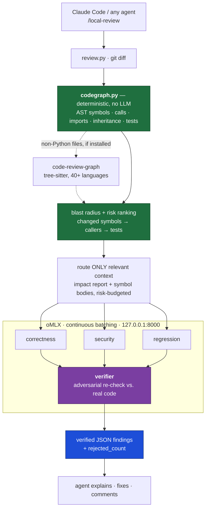

<div align="center">

# Local Code Review

**The code review platform that runs entirely on your laptop.**

A parallel council of local AI reviewers — correctness, security, regression — routed by a
deterministic code graph and gated by a skeptical verifier. No cloud. No API bill. No PR required.

[](docs/superpowers/specs/2026-08-30-graph-routing-layer-design.md)
[](#requirements)
[](#how-it-works)
[](#requirements)
[](#vs-hosted-review-platforms)
[](LICENSE)

[Quickstart](#quickstart) · [How it works](#how-it-works) · [vs. CodeRabbit](#vs-hosted-review-platforms) · [Any agent](#use-it-with-any-coding-agent) · [Output contract](#output-contract)

</div>

---

CodeRabbit, Greptile, Qodo and friends solved AI code review — then put it behind a seat price, a
GitHub App, and a copy of your source on someone else's servers. This does the same job on your own
machine, on your own diff, before the PR exists.

One command runs your diff through a **deterministic code graph** (AST symbol index → blast radius →
risk ranking) that decides *where to look*, routes only the relevant functions, callers and tests to
**three specialized local reviewers in parallel**, then a **skeptical verifier** re-examines every
candidate finding against the actual code. Only findings that survive verification reach you.

```text
> /local-review --staged

Local Review Council — 2 verified findings

HIGH    auth/session.py:143
        Race condition when refreshing session tokens
        Confidence: 0.94 · Reviewers: correctness + verifier

MEDIUM  api/users.py:71
        Error response breaks existing API contract
        Confidence: 0.87 · Reviewers: regression + verifier

3 candidate findings rejected by verifier.
```

That last line is the point. Hosted reviewers are scored on how much they say; this one is scored on
what it can defend. Every finding is independently re-verified against the code, and the rejects are
counted in the open.

## Why this exists

|  | |
|---|---|
| 🔒 **Actually private** | The diff, the context, the findings — all of it stays on your Mac. Nothing is sent anywhere, so nothing needs a DPA, a vendor review, or a security exception. |
| ⚡ **Parallel, not sequential** | Three reviewers hit oMLX's continuous-batching server simultaneously. One loaded model serves the whole council at aggregate throughput a for-loop can't touch. |
| 🎯 **Routed, not sprayed** | A stdlib-`ast` code graph picks the context: changed symbols, their callers, their tests, risk-ranked to a budget. The LLM sees what matters, not the first N KB of diff. |
| 🧪 **Verified, not asserted** | A dedicated adversarial pass re-checks every candidate against the real code and drops anything speculative (confidence gate: 0.80). |
| 💸 **$0 forever** | No seats, no per-PR pricing, no token meter. Your laptop is the whole bill. |
| 🧩 **Not Claude-only** | It's a script that prints one JSON object. Claude Code, Codex, Cursor, Copilot, or a bash loop — all first-class. |

## vs. hosted review platforms

| | **Local Review Council** | CodeRabbit / Greptile / Qodo |
|---|---|---|
| **Cost** | $0 — runs on hardware you own | $15–40 per seat / month |
| **Where your code goes** | Nowhere. `localhost:8000` | Uploaded to the vendor's cloud |
| **When you can review** | Any time — uncommitted, staged, or a branch | After you push and open a PR |
| **Works offline** | Yes | No |
| **Context selection** | Deterministic code graph: blast radius + risk ranking | Vendor-internal retrieval |
| **False-positive control** | Explicit verifier pass; rejects reported in the open | Tunable filters, opaque |
| **Prompts** | Plain markdown you can edit | Vendor-controlled |
| **Runs in your agent** | Any agent that can run a shell command | GitHub/GitLab PR comments |
| **Language coverage** | Python graph built in; 40+ via optional adapter | Broad, out of the box |
| **Setup** | `omlx start` + one plugin install | OAuth a GitHub App |
| **Team dashboards, PR bots, SSO** | ✗ | ✓ |

**Where hosted tools still win:** org-wide dashboards, PR-thread automation, SSO/compliance
reporting, and broad language coverage with zero setup. This is not a drop-in replacement for a
platform contract — it's the review you run *before* the PR, on the diff nobody else has seen yet.

## How it works



The graph layer answers *"where should we look?"*; the LLM layer answers *"is there actually a bug,
why, and how confident are we?"* Deterministic code intelligence as the routing layer for a fast
ensemble of local reviewers — not another generic LLM spraying PR comments.

The entire engine is **two stdlib-only Python files**: `codegraph.py` (the deterministic
intelligence — no LLM, no HTTP) and `review.py` (orchestration + oMLX council). No pip installs, no
venv, no framework. `SKILL.md` is a thin UX layer; the pipeline lives in Python where it belongs.

### Multi-language routing (optional)

Python is routed by `codegraph.py`. For **other languages**, the engine will use
[`code-review-graph`](https://github.com/tirth8205/code-review-graph) as a second routing source if
you happen to have it installed and built:

```bash
pip install code-review-graph && code-review-graph build   # optional, 40+ languages via tree-sitter
```

It is strictly optional and read-only: the engine never builds or updates that graph, only reads it,
and every symbol it reports is intersected with the lines your diff actually touched before it is
trusted. Absent, unbuilt, stale, or slow → those files keep hunk windows. Disable with
`LOCAL_REVIEW_CRG=0`.

## Quickstart

**1. Serve a local model with oMLX** (one loaded model serves the whole council):

```bash
pip install omlx        # or: brew install omlx
omlx start              # OpenAI-compatible server on 127.0.0.1:8000
```

**2. Install in Claude Code — as a plugin** (this repo is its own marketplace):

```text
/plugin marketplace add adityak74/local-code-review
/plugin install local-review@local-code-review
```

Or as a personal skill via symlink:

```bash
git clone https://github.com/adityak74/local-code-review.git ~/Projects/local-code-review
ln -sfn ~/Projects/local-code-review/skills/review ~/.claude/skills/local-review
```

**3. Review:**

```text
/local-review:review           # plugin install (use /local-review for the symlink install)
/local-review:review --staged  # staged changes only
/local-review:review HEAD~3    # last three commits
/local-review:review main...   # your whole branch
```

Arguments pass straight through to `git diff` — every range you already know just works.

**Standalone (no Claude Code):** the engine is a plain script that prints JSON:

```bash
python3 skills/review/scripts/review.py --staged | jq '.findings'
```

## Use it with any coding agent

The engine has no Claude dependency — it's one command that prints one JSON object, so any agent
that can run shell commands can use it. Paste this block into the instruction file your agent reads:

```markdown
## Local code review

To review code changes with a local AI review council, run:

    python3 ~/Projects/local-code-review/skills/review/scripts/review.py [git-diff-args]

(no args = all uncommitted work; `--staged`, `HEAD~3`, `main...` etc. pass through to git diff).
It prints one JSON object; progress on stderr can be ignored. Report ONLY the entries in
`findings` (they are verifier-approved) with file:line, severity, and evidence; mention the
`rejected_count`. If the JSON has an `error` key, show it and stop (usually fixed by `omlx start`).
Never invent findings beyond the JSON.
```

Where to paste it:

| Agent | Instruction file |
|---|---|
| **Claude Code** | none needed — install the plugin or skill above |
| **Codex CLI** | `AGENTS.md` (repo root or `~/.codex/AGENTS.md`) |
| **OpenCode** | `AGENTS.md` in the project root |
| **GitHub Copilot** | `.github/copilot-instructions.md` |
| **Cursor** | `AGENTS.md` or a rule in `.cursor/rules/` |
| **Anything else** | wherever it reads custom instructions — the engine is just a shell command |

## Configuration

Environment variables. That's all of it.

| Variable | Default | Purpose |
|---|---|---|
| `LOCAL_REVIEW_MODEL` | `lmstudio-community/Qwen3.6-35B-A3B-MLX-4bit` | Model the council uses |
| `OMLX_BASE_URL` | `http://127.0.0.1:8000` | oMLX server address |
| `OMLX_API_KEY` | read from `~/.omlx/settings.json` | Auth, if you've enabled it |
| `LOCAL_REVIEW_CRG` | `1` | Set `0` to disable the optional multi-language adapter |
| `LOCAL_REVIEW_CONTEXT_BUDGET` | `80000` | Chars of prompt context per reviewer |
| `LOCAL_REVIEW_REQUEST_TIMEOUT` | `300` | Seconds per model call |

Reviewer behavior lives in plain-markdown prompts (`skills/review/prompts/*.md`) — edit them, no
code changes required. That's the whole customization story: no rules DSL, no web console.

## Output contract

`review.py` prints exactly one JSON object to stdout (progress goes to stderr):

```json
{
  "findings": [
    {
      "file": "auth/session.py", "line": 143, "severity": "high",
      "category": "correctness", "title": "…", "explanation": "…",
      "evidence": "…", "confidence": 0.94, "verified": true,
      "reviewers": ["correctness", "verifier"]
    }
  ],
  "rejected_count": 3,
  "stats": {
    "model": "…", "duration_s": 41.2, "files_reviewed": 4,
    "context_truncated": false, "malformed_dropped": 0, "failed_reviewers": [],
    "graph": {
      "files_indexed": 212, "parse_failures": 0, "symbols": 1840,
      "changed_symbols": 3, "impacted_symbols": 11, "untested_changed": 1,
      "crg": { "changed_symbols": 2, "files": 1 }
    }
  }
}
```

`stats.graph` appears when the deterministic first pass ran (the diff touched Python files); if the
graph fails for any reason the engine falls back to plain hunk windows and reviews anyway.
`stats.graph.crg` appears only when `code-review-graph` also contributed routing for non-Python
files.

On an empty diff, it short-circuits to `{"findings": [], "note": "nothing to review"}` — no
`rejected_count` or `stats` keys. On a fatal error (git failure, oMLX unreachable, or anything
unexpected), it prints `{"error": "…"}` and exits 1.

Machine-readable by design — the Claude Code skill is the first consumer, not the only one.

## Requirements

- Apple Silicon Mac (built on an M-series with 48 GB; smaller models fit smaller machines)
- Python 3.9+ (stdlib only — no packages)
- [oMLX](https://github.com/jundot/omlx) serving any instruct model you like
- git

## Roadmap

The Claude Code skill is the first distribution surface, not the architecture. The engine is
deliberately a standalone JSON-emitting program so more surfaces can wrap it:

- [x] Design spec ([docs/superpowers/specs](docs/superpowers/specs/2026-08-29-local-review-council-design.md))
- [x] v0: council + verifier engine, Claude Code skill
- [x] Claude Code plugin + self-hosted marketplace (`/local-review:review`)
- [x] v1: deterministic code graph routing — changed symbols, blast radius, risk ranking ([spec](docs/superpowers/specs/2026-08-30-graph-routing-layer-design.md))
- [x] Optional multi-language routing via `code-review-graph`
- [ ] Standalone CLI polish (`local-review` entry point)
- [ ] MCP server (one reviewer for Claude Code, Codex, OpenCode, Zed, …)
- [ ] GitHub Action & pre-commit hook
- [ ] llama.cpp backend (the engine only speaks OpenAI-compatible HTTP)

## Known limitations

Stated up front, because a review tool that hides its blind spots is worse than one that has them:

- The built-in symbol graph is Python-only (stdlib `ast`). Other languages get symbol routing only
  when the optional `code-review-graph` is installed and built, and even then only risk-ranked
  changed symbols — blast radius stays Python-only. Without it they fall back to hunk-window
  context. Call/inheritance edges are name-based — ambiguous bare names are deliberately dropped,
  never guessed, so dynamic dispatch and duplicate names thin the blast radius.
- Pure renames and git-quoted paths are skipped by the diff parser.
- The same bug flagged by two categories surfaces as two findings — dedupe is per-category by design.
- Diff content is not defended against prompt injection; don't point it at untrusted PRs expecting
  adversarial robustness.
- No overall wall-clock timeout.
- Findings are only as good as the local model you serve. A 4-bit 35B council is not GPT-5-class
  reasoning — it is, however, running on your machine for free while you type.

## Contributing

Issues and PRs welcome. The design specs and implementation plan live in
[`docs/superpowers/`](docs/superpowers/) — read the specs first; they're the binding authority for
how the pipeline behaves. Keep the engine stdlib-only: deterministic intelligence in `codegraph.py`,
LLM orchestration in `review.py`, and never an LLM call in the first pass.

## License

[MIT](LICENSE) © Aditya Karnam
